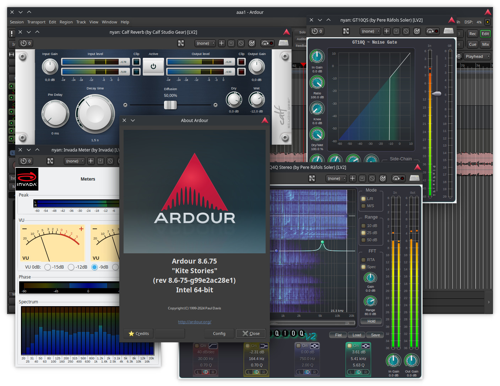

lv2-gtk-ui-bridge
=================

lv2-gtk-ui-bridge is a special LV2 bundle that allows to use legacy LV2 Gtk2/3 UIs as LV2 X11 UIs.  
This increases the compatibility of such UIs to hosts that do not support the legacy UI types.

Because Gtk2/3 can often conflict with host function symbols (e.g. a Gtk4 host can't load Gtk3 libraries) the UI is loaded in a separate process.  
This means the UI can load without crashing the host if usually there would be function symbol conflicts,
but in return it is not possible to support LV2 instance access nor LV2 data access (which some UIs use for fancy fast graphs).  
Parameter changes and LV2 atom messages still work as normal though, passing through an IPC layer.

The list of supported plugins is hardcoded in [lv2-gtk-ui-bridge.lv2/manifest.ttl](lv2-gtk-ui-bridge.lv2/manifest.ttl).  
This file needs to be updated in order to support more plugins with a Gtk2/3-based UI.  
Just create a ticket or a pull request in case I missed any.



Dependencies
------------

To build this project the following libraries/packages are required:

 - gtk2
 - gtk3
 - lilv
 - lv2
 - make
 - pkg-config
 - x11

Under Debian-based systems these can be installed with:

```sh
sudo apt-get install libgtk2.0-dev libgtk-3-dev liblilv-dev lv2-dev libx11-dev make pkg-config
```

Build
-----

After dependencies are installed simply run `make` in the directory where this project source code is located.

Install
-------

After a successful build, simply copy or symlink the `lv2-gtk-ui-bridge.lv2` bundle into any direction within the `LV2_PATH`, for example `~/.lv2/`.

Note that there is no `make install` step, you can easily just copy the bundle yourself.
